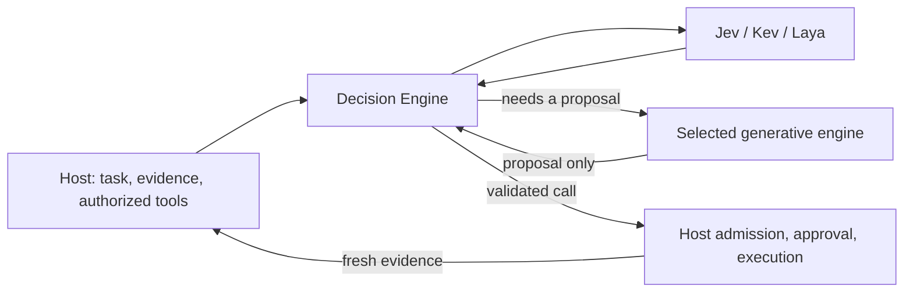

# Structured decision plane — living contract

Agentic execution and managed direct chat use the tool-independent `/v1/action`
rail when `tool_action_judge` is configured (the repo seed enables it with hosted
Jev). All authorized tools (Browser, Android, CUA, …) share one catalog, planner
escalation and action lowering; there is no surface-specific judge code, config
or pack. `/v1/step` has no handler. Contract version 5 (`CONTRACT_VERSION`) keeps
native/harness action proposals and bounded classification batches, and carries
memory authorization and observation/batching policy in engine discovery. Host and engine
binaries must be upgraded together; mixed major versions fail closed.

Native planner adapters heap-allocate provider dispatch futures so nested debug calls fit ordinary execution worker stacks.
Catalog argument projection uses the dispatch policy's passthrough classification; ordinary browser arguments remain available while explicit outward actions retain their existing gates.

Design history: structured decision plan,
shared action rail record.

## What this is

A vendor-neutral plane for **typed decisions** — Choice (pick from declared
options, with the full probability distribution), Score (rubric level), and
Noul (yes/no probability) — asked as versioned question packs against a
state, answered by swappable model adapters. One HTTP adapter serves every
model on the `/v1/systemone` wire: hosted TypeSafe Jev (`typesafe`) and
self-hosted Jev-style models such as laya or Kev (`systemone`). Planned:
a `generative` fallback (same IR through a chat model, uncalibrated).

Deterministic code still owns policy (funnels, required-action rules,
grants, loop detection); LLMs still own prose. This plane owns the space in
between: judgments whose output is consumed by code.

## Default model dispatch

All engine-managed Jev, Kev and Laya calls (action requests, classification
batches, standalone engine clients) enter a bounded in-memory per-model queue
built on `runtime_core::fair_queue::FairLane`, the same component MagicLLM uses
(separate queues per process; decision jobs never become generative LLM
requests). Owners run FIFO within a lane and operations take turns; foreground
has priority, background gets a turn after three foreground pickups and reserves
one foreground slot when concurrency permits. Routing, thresholds, fallback and
provider retry stay inside the Decision Engine. Native/harness LLM calls outside
the managed router are outside this boundary.

- Model settings `queue_capacity` (default 64) and `queue_max_bytes` (default
  4 MiB) bound waiting work separately from `max_in_flight`. Admission has a
  120 s ceiling even without a caller deadline.
- Cancelling a waiter releases its reservations; queue pressure/expiry does not
  mark the provider unhealthy or create a physical receipt. Compatible reloads
  resize the existing queue. Queue settings do not enable local fallback.
- Local model seeds use one active request; MLX workers have bounded handoff
  channels that skip cancelled work, but a running GPU kernel keeps its slot
  until it finishes.
- Background gates can set `classification.queue_budget_ms` plus
  `decision_budget_ms`; inference allowance starts after admission and the
  caller deadline (including reserved text-stage time) still wins. Memory
  background seeds: 30 s queue + 30 s inference, one item at a time; foreground
  `memory_applicability` keeps 3 s.
- Physical receipts expose `queue_wait_ms` separately from `latency_ms` (wait is
  repeated, not summed, across retries); cost/token accounting stays one record
  per physical attempt.

Tests: `make test-model-dispatch`.

## Shared action rail

The Decision Engine owns candidate construction, model routing and fit checks,
confidence thresholds, consecutive-step limits, planner escalation and selection.
Magician supplies the current authorized catalog, task instructions, safe tool
result projections and observations. Returned calls use ordinary native action
lowering and Apply authorization, approval and verification. Run cancellation,
resource limits, loop protection and privacy boundaries remain host obligations.



### Selection and fallback

`decision-engine-contract::action` defines the contract; `magician-decision/src/action`
implements the policy with no tool-name branches (skills need no annotations).
A request carries schemas for currently authorized tools, bounded evidence,
task context and an optional continuation plan.

- **Candidates** come from the next proposed step or from schema constants,
  enums, booleans and matching typed values in successful evidence. Every
  complete argument object must pass the tool's JSON Schema; external schema
  references are refused. Deliberately conservative: free-form writing, opaque
  JSON strings and ungrounded values need a generative proposal.
- **Two typed stages**: a selector picks a concrete call or asks for a planner;
  a review judges **that exact call** for evidence sufficiency and applicability.
  Both must meet the answering model's thresholds. Missing routes, unfit models,
  uncertainty, a failed previous action, changed instructions, an exact repeat
  of the latest call, or the consecutive-step cap request the planner.
  `action_timeout_ms` bounds both stages together (default 8,000 ms; 0 skips
  typed evaluation); the host socket timeout must exceed it. Pinned models also
  honor declared context/choice limits — an oversized request escalates rather
  than truncating evidence.
- **Planner round**: only the engine can request it. The generative engine
  returns `steps` (exact tool name, arguments, optional JSON Pointer bindings to
  evidence); the host submits them to `ResolvePlanner`, which validates the
  first call against the same catalog and records it with `origin: planner`
  (no structured confidence claimed). Later steps are re-judged with fresh
  evidence. The plan persists in the run's protective state, scoped to the task
  instructions and revalidated against each current catalog, so a changed tool
  grant cannot be bypassed by a saved plan.
- **Failures**: transport errors and mismatched snapshots fail the host
  decision; they never authorize a cached call. Old engines fail the contract
  check rather than silently restoring the previous path. Disabling the
  engine/operation restores the selected-engine path. Deploy host, engine and
  question pack together.
- **Excluded**: workflows with an application disclosure guard, protected
  app-memory/result iterations and catalogs exposing governed app-data handlers
  keep their dedicated physical-provider boundary. Direct Realtime provider tool
  calls and independently launched CLIs are outside; Realtime `delegate_to_chat`
  enters the rail.
- **Chat**: chat-launched tasks inherit the run engine and use this loop.
  Managed direct chat runs the selector before generative planning: native
  function calls become proposals and only the engine-selected call enters the
  chat dispatcher; remaining proposals are re-judged on later iterations.
  Foreign chat harnesses use restricted proposal sessions with fresh homes (no
  resumed CLI sessions with work authority); the host owns the tool loop,
  refreshes the grant's catalog after each call, and buffers planner text until
  selection (native chat prose still streams). Text-only final replies stay with
  the selected chat engine. A transport failure or disable reload mid-turn stops
  a foreign turn and preserves its tool ledger; no replay through a fallback
  engine. Current prompt images and fresh MCP image blocks reach restricted
  planners through image channels; tool-returned paths/URLs are not read.
  Structured-only steps do not emit native LLM usage events or inherit a
  generative profile's app-data authority.

### Selected execution engines

Magician, Pi, Claude Code, Codex, Codex App Server, Grok and Agy all share
structured selection. On escalation:

- Magician uses its native provider adapter, accepting a proposal tool call or
  a strictly parsed JSON plan; others use the execution-plane harness factory,
  preserving the run's model/profile choice. Pi receives the selected Magician
  profile's credentials and model (a Pi with no explicit profile keeps its own
  login/default model); other harnesses never inherit that profile.
- One-shot CLI and Codex App Server sessions include planner instructions in
  their input (no shared system-message flag) and use the terminal reply.
  Plan parsing strips only outer string presentation labels (`toolAction`,
  `toolSummary`) and top-level explanations; call fields and arguments stay
  strictly validated. Agy and managed Grok use their CLI's structured/JSON-schema
  terminal output (Grok keeps progress streaming for the idle watchdog).
- Pi proposal transcripts stay in the temporary planner home and are removed
  on shutdown.
- Jev/Kev/Laya are Decision Engine profiles, separate from LLM profiles.

Planner sessions receive no work executors. Their short-lived grant allows only
`decision_submit_plan` and, when images exist, `decision_read_images` (returns
already captured images; cannot capture or operate a device; images are excluded
from the ledger's text payload). Pi and stripped CLI adapters remove native work
tools; sandboxed adapters keep what their CLI supports. Agy uses a private
workspace MCP config and a proposal-only custom agent — its sandboxed native
tools remain, so it is not equivalent to a stripped registry. The grant cannot
execute proposed work even if a harness calls a work tool directly; the selected
call executes only through the host. Planner catalogs share repeated parameter
schemas without dropping tools or constraints; execution validates the originals.

### Standalone CLI boundary

A terminal-launched CLI's own file/shell/browser tools do not enter the shared
loop. Direct calls to Magician's MCP work tools pass the plane's authorization,
approval and execution gates but do not ask the selector to choose the next
action; connecting an MCP server does not transfer loop ownership. A CLI that
wants grounded multi-step actions delegates through the plane's `run_task`,
which uses the rail. Intercepting arbitrary native CLI tools would need that
CLI's cooperation (extension/hook or controlled executor) and is not provided.

### Configuration and evidence

Repo seed and live runtime config:

```yaml
operations:
  tool_action_judge:
    model: jev
    pack: tool_action_judge
    pack_version: "1.0.0"
    sees_body: true
    gate:
      enabled: true
      max_consecutive_steps: 3
    thresholds:
      next_action_confidence: 0.7
      evidence_sufficient: 0.7
      action_applicable: 0.7
```

The 0.7 thresholds still need broader production calibration; tune them from
live evaluations, not to make a fixture execute. To route local models, replace
`model` with a tier/routing and supply `thresholds_by_model` for each profile.
Laya's small context and Kev's declared capabilities determine fit; a model that
cannot fit is skipped. Local privacy mode never promotes a body-seeing operation
to a cloud model. Declaring local profiles does not load them.

Rollout knobs per operation: `shadow.enabled` requests evaluation without
structured execution; `gate.enabled` permits structured selection. The shared
operation ships gate on, shadow off. Observation steps are chosen through the
same catalog and evidence contract as any other action; dependent observations
reuse the current session/resource through plan arguments or evidence bindings.

### Decision Model usage and pricing

Every physical Decision Model attempt (selection, exact-call review, retries,
fallback models) returns a content-free `model_calls` receipt on `/v1/action`
and `/v1/decide`: stable call/retry IDs, adapter, requested and actual model,
operation, status, start/end time, latency, optional input/output/cache buckets.
Billed responses keep usage even when their answers fail validation;
deadline-dropped attempts keep a cancelled receipt with unknown usage. Models
skipped for fit or cooldown are not calls. Local Laya/Kev has zero API cost
(hardware/electricity not estimated). Model residency is not prompt-cache usage.
Any new adapter gains call tracking automatically; one with internal retries
must report each physical attempt.

Managed chat (native and harness) and agentic runs publish these receipts into
the scoped canonical call/attempt journal and `llm_calls` analytics with
`decision:<provider>` identities and `decision_model` response kind, keeping
task/session/turn/activity lineage. Spend views count them once; `/llm` → Cost
has a **Decision Models** breakdown, Usage a **Decision Models** filter and
per-call cache columns. Chat turn totals include decision calls without
assigning them to the planner model. A cancelled UI turn stops dispatch while
its bounded collector finishes accounting for issued calls. A process crash or
lost engine response can leave usage unavailable; nothing is estimated.

Rates use the effective-dated `llm_pricing.json` overlay (seed:
`magician_data_v3/llm_pricing.template.json`) and LLM pricing-row fingerprints.
Built-in row: `decision:typesafe` + `jev-1.13` at $0.042 per million input
tokens, output free, per [TypeSafe's model card](https://docs.typesafe.ai/models);
a new model family needs a new dated row. Only the official HTTPS endpoint gets
that identity; custom System One endpoints use `decision:systemone:<adapter>` and
need an explicit rate. Local adapters: `decision:laya-mlx`, `decision:laya-onnx`,
`decision:kev-mlx`, `decision:kev-onnx`. Restart Magician after editing prices;
stored charges are not rewritten.

[The Jev API](https://docs.typesafe.ai/api) reports input/output tokens and no
cache counters, so cache fields stay **Not reported** (never zero) and cache
ratios use measured calls only. Unknown prices or absent billed usage stay null,
distinct from free local calls; the breakdown reports unpriced call counts and
cache coverage so a partial total cannot pass as full. The shared cost reader
accepts `local` pricing at zero API cost and rejects contradictory nonzero local
charges. Public-chat admission keeps unknown USD null and uses its configured
fallback after an unpriced paid response; it never invents a charge to enforce
the cap.

`AgenticDecisionMade` carries the operation, structured/planner origin, initial
fallback reason, selected/review model, aggregate typed usage and latency.
Planner calls emit ordinary LLM request/response events. Native providers keep
their router receipts; CLI aggregate usage is labeled `harness:<engine>` with no
invented attempt count. Reported cache buckets and CLI USD estimates are kept;
`usage_availability` distinguishes unreported buckets from zeros, and
unavailable chat, event, canonical and legacy Parquet cost stays null. Canonical
`harness_aggregate` facts keep estimates without inventing physical attempts;
private Pi profiles without pricing keep cost unknown. CLI estimates do not
establish subscription billing. Observations and credentials are not copied into
decision events. Structured usage is charged to the execution token meter before
a call proceeds; a CLI with missing usage fails closed under a hard execution
token budget. Received planner responses keep their usage even when the proposal
fails parsing/validation; a rejected proposal never gains execution authority.

### Opt-out and failure visibility

- To stop Jev evaluation while keeping shared proposal validation, set both
  `operations.tool_action_judge.gate.enabled: false` and
  `operations.tool_action_judge.shadow.enabled: false` in `decision-engine.yaml`
  (the engine reloads automatically).
- **Settings → Engines → Decision Engine** is the server-wide control:
  **All Engines** (`decision.mode: all_engines`, default), **Magician Only**
  (`magician_only`), or **Off** (`off`). It applies to managed direct chat and
  agentic execution using each chat's selected engine and each run's engine pin;
  excluded engines use their ordinary paths without contacting the service.
- Owner-session `PUT /api/magician/v2/plane/decision-mode` accepts
  `{ "mode": "magician_only" }`, persists the host config and reloads it;
  `GET /api/magician/v2/plane/engines` includes the active `decision_mode`.
  Manual file edits apply through the config reload endpoint. In-flight
  decisions keep their captured client; an external harness turn finishes under
  its starting policy.
- Legacy host `decision.enabled: false/true` loads as `off/all_engines`; saves
  write only `mode`, and specifying both is rejected. Engine-side `enabled`,
  gate/shadow, thresholds and model selection stay engine-owned.
- Jev timeout/API/fit failures request the selected generative planner. A
  missing engine socket, invalid reply or incompatible contract stops the
  managed turn. Agentic decision events and chat Decision Engine logs carry
  fallback reasons; `/health` confirms the process runs, not that provider
  credit exists. HTTP 429 quota/credit failures keep their classification and
  skip ineffective throttle retries.
- Scoped service-health HITL notices cover authentication, exhausted credit,
  rate limits (including Agy's subscription quota) and outages of the Decision
  Engine/model or LLM services, including background queue failures and refused
  harness turns even with the engine Off. They deduplicate, support dismissal
  (acknowledges without retrying work) and clear after a successful call to the
  same service/profile. One-shot sessions classify stderr-only failures; stderr
  stays out of replies and notice text.
- No-progress termination reports unfinished work instead of full success.

## Locked rules

- Structured decision is **not** an LLM profile. It never rides a
  `complete() -> String` seam and never appears as an `LLMProviderKind` or
  in `llm-router.yaml` `operation_mapping` — a chat-shaped seam destroys the
  probability distribution and lets router fallback hop a decision onto a
  profile that cannot answer it.
- Answers are constrained to declared options. An undeclared option is a
  transport error (`DecisionError::UnknownOption`), never a silent coerce.
- Noul has no separate confidence; distance from 0.5 is the uncertainty
  signal. Choice-tuned thresholds are never carried onto a Noul.
- Thresholds are keyed per model id. A threshold tuned on one model is a
  review item before reuse on another.
- An absent operation is off. A configured shared action operation with no
  fitting structured route explicitly requests the selected generative planner;
  it never treats an LLM profile as a structured model.
- `calibrated: true` is claimed only by adapters whose probabilities are
  verified (TypeSafe Jev today); composition must not treat uncalibrated
  confidence as calibrated.
- Rollout discipline for every consumer: idle-until-bound, shadow-before-flip,
  thresholds keyed per model id, rollback = re-bind one operation.

## Crate layout (`magician-decision/`)

- `src/primitives.rs` — Choice/Score/Noul question IR, contrastive criteria.
- `src/request.rs` — `DecisionRequest`/`DecisionResponse`, answer validation,
  dynamic Choice candidate injection (`set_choice_candidates`).
- `src/model.rs` — the `StructuredDecisionModel` adapter trait.
- `src/pack.rs` — versioned pack loading from
  `data/magician_v2/decision_packs/<pack>/<version>.json` (override root →
  repo data tree → beside-executable → CWD; missing pack ⇒ operation idle).
- `src/compose.rs` — threshold helpers and content-free shadow comparison.
- `src/runtime.rs` — operation → pack → adapter binding; re-validates answers.
- `src/action/` — shared action rail policy.
- `src/adapters/memory.rs` — scripted test double.
- `src/config.rs` — the settings schema.
- `src/engine.rs` — settings → bound runtime: model profiles, key lookup,
  locality filter, pack loading (`build_runtime`; `build_runtime_with` injects
  pack store and env lookup for tests; `build_runtime_in` loads in-process
  models through a `ModelRegistry`).
- `src/registry.rs` — in-process models for one settings set, shared by every
  route and both locality runtimes; a reload's registry takes over unchanged
  models and releases the rest.
- `src/host.rs` — memory gate for in-process models.
- `src/adapters/typesafe.rs` — hosted Jev as the `typesafe` profile of the
  System One adapter.
- `src/adapters/systemone.rs` — every `POST /v1/systemone` model: IR↔wire
  mapping, Bearer auth only when the profile carries a key, 429/529/5xx/timeout
  retries honoring `retry-after`, no-redirect client, 1 MiB bounded body read,
  unknown-option refusal, response model echo checked against the requested
  pin. Config pins `jev-1.13.0` (`jev-latest` answers as a concrete version and
  would mismatch the pin on every call).
- `src/adapters/laya*.rs`, `kev*.rs` — local model adapters (below).

The crate depends on neither `magician` nor `magician-comms` nor any
decision-model vendor.

## Settings: `decision-engine.yaml` (engine) and `decision:` (host)

Engine settings — models, tiers, operations, thresholds, shadow/gate — live in
`<runtime root>/decision-engine.yaml`, read only by the `decision-engine`
process. The git-backed seed is repo-root `decision-engine.yaml` (no separate
template); installers, the container entrypoint, `seed-silverbullet-space.sh`
and `package-release.sh` seed it beside `magician-config.yaml` when absent, and
never overwrite an existing live file. It is separate from `llm.router` and
never merged into `llm-router.yaml`. The crate owns the schema
(`magician-decision/src/config.rs`, `deny_unknown_fields`) and binding
(`magician_decision::engine::build_runtime`). `TYPESAFE_API_KEY` is referenced
by `api_key_env` in `magician_data_v3/.env.example`.

The seed declares local MLX profiles for multilingual Laya, Kev 0.8B and Kev 4B
(install with `make setup-decision-models MODELS="laya-multilingual-mlx
kev-0.8b-mlx kev-4b-mlx"`; Kev 4B needs ≥ 24 GB host memory). They stay
unloaded until an operation routes to them.

Magician's `decision:` block in `magician-config.yaml` (`DecisionHostConfig` in
`magician/src/config.rs`, `deny_unknown_fields`): `mode` (`all_engines`,
`magician_only`, `off`), `socket` (unset = `<runtime root>/run/decision-engine.sock`),
`timeout_ms` (default 20,000, covering the engine's model call; the action
budget defaults to 8,000 ms). An engine key there (`models`, `operations`,
`tiers`, …) fails the config load.

Idle-until-bound: `enabled: false` or an absent operation keeps the incumbent
host path. A missing model, key or pack leaves the route unavailable with a
warning — for the shared action rail, an explicit planner escalation. The
generic `/v1/decide` endpoint serves classification consumers; it never chooses
or dispatches tool actions.

Live settings: the engine re-reads `decision-engine.yaml` on change (every 2 s;
`decision_engine::watch_settings`) without restart. New routes are bound beside
the current ones — newly routed local models load while current settings keep
serving — then swapped in, so no request sees a half-loaded model. A model whose
entry is unchanged and still routed stays loaded (the whole entry is the key);
a model no longer routed is unloaded once its requests finish. Nothing unloads
for idleness. An unparseable file is logged (`decision settings rejected;
keeping the current ones`) and current settings keep serving. Magician reads
operation discovery before each shared action decision. `onnxruntime_path` is
the exception: it applies on restart only.

Model entries:

- `adapter: typesafe` — hosted Jev. `endpoint` defaults to
  `https://api.typesafe.ai/v1/systemone`, `api_key_env` to `TYPESAFE_API_KEY`
  (required). Profile: calibrated, remote, 32,768 state tokens, 255 Choice
  options, Score supported.
- `adapter: systemone` — a self-hosted model. `endpoint` required;
  `api_key_env` optional but must resolve if named. Claims nothing
  (uncalibrated, limits undeclared) until `capabilities:` (`calibrated`,
  `max_state_tokens`, `max_choice_options`, `supports_score`) declares it.
  Responses carry adapter `systemone`, so thresholds never mix with Jev's.
- `laya-onnx`, `kev-onnx`, `laya-mlx`, `kev-mlx` — in-process local models (below).
- Locality is derived from the endpoint host, never declared: only
  `localhost`, `127.0.0.0/8`, or `::1` is local. In local mode a body-seeing
  operation binds a local model and refuses a remote one unless
  `allow_remote_when_local` is set on that operation.

### Model selection and operation mappings

Settings → Engines → **Decision models and operation mappings** edits each
operation's local and cloud routes independently; each has one primary and an
optional backup (Jev only, Kev only, Jev → Kev, Kev → Jev). Processing locality
comes from the same live router as LLM operations, so changing
`privacy.processing.mode` applies without restart; the All Engines / Magician
Only / Off switch is independent. Settings are server-wide.

```yaml
operations:
  memory_applicability:
    routing:
      local: {primary: kev-4b, backup: null}
      cloud: {primary: jev, backup: kev-4b}
    allow_remote_when_local: false
    thresholds_by_model:
      jev: {applicable: 0.7, load_bearing: 0.7}
      kev-4b: {applicable: 0.75, load_bearing: 0.75}
    # Existing pack, gate and execution-budget settings remain required.
```

- `routing` takes precedence over legacy `model`, `tier`, `fallback_models`.
  Legacy mappings stay readable (including tiers with >2 entries) and the editor
  never truncates them.
- Every selected model needs its own complete thresholds; the UI never copies
  another model's calibration. Profiles sharing a wire model identity must use
  identical thresholds within a route to avoid ambiguous gating.
- Explicit local mappings reject remote primaries/backups unless
  `allow_remote_when_local` is set, even for operations without user bodies.
  Memory seeds keep an operator-approved remote exception (Jev → Kev in both
  modes); local-only users can select Kev and disable it.
- Owner-authenticated `GET/PUT /api/magician/v2/plane/decision-routing` proxies
  the engine's owner-only socket `GET/PUT /v1/settings/routing`. The engine
  validates and atomically persists one operation, rejects stale revisions with
  409, and keeps credentials off the response; invalid updates change nothing.
  Saved and active state are separate: the UI polls while the watcher loads new
  weights and shows actual bound routes, so missing credentials/models cannot
  look like a working primary.

Routing and thresholds:

- Legacy: an operation pins `model:` (explicitly retried without cooldown) or
  names `tier: small | large` over `decision.tiers` (entry names in preference
  order). `tier: small` routes small then large; `tier: large` routes large
  only. A pin wins when both are set. `fallback_models: [kev-4b]` appends
  explicitly named alternatives (remote entries need permission in local mode),
  each with its own `thresholds_by_model`.
- Backups: tool-action selection/review and classification (batched or not)
  reserve deadline time for backups and try them on failure or uncertainty.
  Gated classification divides the remaining deadline among fitting entries,
  keeps a coherent single-model response, and refuses a fallback that
  contradicts or loses a previously confident head. Route time-slice expiry is
  recorded without declaring a provider outage; real provider failures keep
  shared cooldown and health reporting. Every attempt keeps its own receipt.
  Routed local fallbacks load their weights even when Jev answers. No
  generation-model fallback exists for memory classification.
- On a multi-model route `DecisionRuntime::evaluate_request` takes the first
  model that fits and is healthy. Fit (`runtime::misfit_reason`, pins too)
  checks declared `max_choice_options`, `supports_score` and `max_state_tokens`
  against a pessimistic estimate (serialized state + questions / 3). A
  transport, status, timeout or malformed-answer failure puts that model on a
  30 s cooldown (cooling providers skip admission queues). Nothing fits →
  `DecisionError::NoFittingModel`, treated as unbound. An exhausted execution
  budget on a fitting route reports `Timeout`, not a fit failure.
- Locality is applied per model at bind time: in local mode a body-seeing
  operation's route keeps loopback models and drops remote ones.
- Thresholds belong to the model that answered:
  `DecisionRuntime::thresholds_for(operation, &response.model)`. The pinned
  model owns `thresholds`; routed models own `thresholds_by_model.<entry>`. A
  model with none returns `None` — the shared action rail reports
  `model_thresholds_unset` and requests the planner, so an escalated answer
  never gates on another model's numbers.

### Engine and host boundary

`decision-engine-contract` owns the typed IR, shared action requests/verdicts
and a Unix-socket client. The server exposes `/health`, `/v1/operations`,
`/v1/decide` (typed classification), `/v1/action` (tool decisions) and
`/v1/settings/routing`, listening on owner-only
`$MAGICIAN_ROOT_DIR/run/decision-engine.sock`.

`magician_v2::decision_host` installs the client and processing locality.
`run_loop/phases/decision_rail.rs` projects authorized tools and evidence,
brokers a requested planner round and lowers the selected call into the
existing executor. A configured engine's transport or contract failure fails the
decision rather than bypassing the rail; explicitly disabling host/operation
restores the generative path. Screenshot recovery stays host transport code in
`agentic/desktop_capture.rs` with no target-selection or action policy.

### Local models

Model files: `make setup-decision-models` downloads pinned revisions (SHA-256
checked) into `models_dir` — default `<runtime root>/models/decision/<name>/` —
and ONNX Runtime into `<runtime root>/lib/onnxruntime/` (runtime root =
`MAGICIAN_ROOT_DIR`, else `MAGICIAN_STORAGE_PATH`, else `~/MagicianNotes`).
Nothing is bundled. `models_dir` (absolute, `~/…`, or runtime-root-relative), an
entry's `model_dir` (relative to `models_dir` or absolute) and `onnxruntime_path`
(folder or library; `ORT_DYLIB_PATH` wins) relocate them; the setup script takes
`DECISION_MODELS_DIR` / `DECISION_ORT_DIR`. The MLX build writes compiled kernels
to `~/.mlx/lib/<hash>/mlx.metallib` (`MLX_RS_METAL_PATH` moves it).

Platforms: Apple Silicon macOS 14+, Linux, and Windows via the Linux container;
Intel Macs unsupported. MLX (`laya-mlx`, `kev-mlx`) needs Apple Silicon and
macOS 14. ONNX Runtime 1.30 (`laya-onnx`, `kev-onnx`) ships for macOS arm64,
Linux x64/aarch64 and Windows, and is the Linux path. ONNX's CoreML execution
provider was slower than CPU for both models and is not used.

Memory gate (`src/host.rs`): in-process models bind only when the machine has at
least `local_min_memory_gb` (default 16) or the entry's `min_memory_gb`; below
it they stay idle with a logged reason and the route falls through (e.g. to Jev).
HTTP models are never gated. Memory is physical RAM rounded to the nearest GB,
capped on Linux by the cgroup limit (v2 `memory.max`, else v1); unreadable = 0
and fails. `DECISION_HOST_MEMORY_GB` overrides. One config then serves every
machine: `large: [kev-mlx, kev-onnx, jev]` uses GPU, then CPU, then Jev.

- **ONNX** (`onnx` feature, enabled only by `decision-engine`, so Magician never
  links ONNX Runtime). Kev's graph needs ONNX Runtime ≥ 1.30 (contrib ops
  `LinearAttention*`, `CausalConvWithState`, `GatedRMSNorm`), newer than `ort`'s
  bundled build, so the runtime loads dynamically; setup installs Microsoft's
  1.30.0 release (SHA-256 pinned per platform) and the engine sets
  `ORT_DYLIB_PATH` unless already set. Sessions open with CPU arena and memory
  patterns off (every request has its own shapes).
  - `laya-onnx`: laya (mmBERT encoder + typed decision head), int8
    `soyelmismo/laya-multilingual-onnx` conversion. `adapters/laya.rs` is the
    model-free port of laya's reference runtime (sequence building,
    temperatures, post-processing); `adapters/laya_onnx.rs` runs the padded
    batch one row at a time (padding is not neutral in this export, so each row
    keeps the batch length). Parity test: `tests/laya_onnx.rs` (gated on
    `LAYA_MODEL_DIR` + `LAYA_PARITY_*`). Its shipped temperatures are 1.0
    (uncalibrated) and it answers near-uniform on long step-judge states — use
    it for short memory/classification questions (small tier), not step judging.
  - `kev-onnx`: Kev (Qwen3.5 + LoRA with a pointer head, kev.js bundles,
    Apache-2.0). `adapters/kev.rs` ports kev.js (rendering, state-then-branches
    token layout, pointer head, per-revision fitted temperature, answer
    formulas); `adapters/kev_onnx.rs` runs the state once and each question as a
    continuation of its caches (last 4 states kept). Parity: `tests/kev_onnx.rs`
    (gated on `KEV_MODEL_DIR` + `KEV_FIXTURES`).
- **MLX** (`mlx` feature, `decision-engine --features mlx`). On Apple Silicon
  every Makefile engine build produces the MLX engine; `DECISION_ENGINE_MLX=0`
  forces the CPU build, which skips `kev-mlx` models. Building needs Rust ≥
  1.95, CMake and Xcode's Metal Toolchain; the binary needs none.
  - `laya-mlx` (`adapters/laya_mlx.rs`): Rust port of laya-mlx's ModernBERT
    encoder, decision head and marker scorer on original fp16 weights; rows,
    calibration and answers shared with ONNX (`adapters/laya.rs`), assets in
    `adapters/laya_assets.rs`. Padding is masked from every key, so answers do
    not depend on batch. Batches ≥ 2,048 tokens are evaluated layer by layer to
    bound intermediate memory. `LayaMlxConfig::compile` exists but is off by
    default. Checkpoints: `laya-multilingual-mlx` (1,024-token context,
    uncalibrated) and `laya-english-mlx` (512-token context, fitted
    temperatures). Parity: `tests/laya_mlx.rs`.
  - `kev-mlx` (`adapters/kev_mlx.rs`): uses `kev-core` from MagicBeansAI/kev-rs
    (fork, pinned by commit), which folds the LoRA into the base in fp32, runs
    Gated DeltaNet layers on a fused Metal kernel and batches questions on the
    state's cache; MLX stays on one worker thread. Questions are grouped by
    branch length (a group spans at most 2×) because kev-core pads to the
    longest row. Default 8-bit weights (affine, group 32, quantized right after
    each merge) and 512-token state passes; `quantize: false` / `state_chunk:`
    change that. 4-bit flips confident answers and is not offered. The adapter
    caps MLX's allocator cache at 512 MB (`DECISION_MLX_CACHE_LIMIT_MB`
    overrides) — uncapped, MLX keeps freed buffers and per-request shapes grow
    the footprint unboundedly. Merge and quantization run at each model load;
    the dev profile optimizes `mlx-sys` CPU kernels so debug loads stay fast.
    Parity: `tests/kev_mlx.rs`; latency: `tests/latency_sweep.rs`.
- Requests present a choice's options sorted by option id (the IR keeps criteria
  in a `BTreeMap`) for every model, not in the caller's order.
- `scripts/bench-decision-engine.py` measures load/latency/memory through
  `/v1/action` (`footprint_peak_mb` counts Metal buffers RSS misses).
  Measurements are in the shared rail record.

### Supervision

`magic-supervisor` runs the engine as `decision-engine.bin` when installed —
started before Magician, health over the socket, restarted after unexpected
exit. The engine binary is the one reviewed place that resolves its runtime root
(typed-storage allowlist), matching Magician's; the supervisor learns the socket
from `decision-engine --print-socket` and passes it back explicitly (see
[supervisor](../magic-supervisor/supervisor.md)). Hosted keys (`api_key_env`)
come from `<runtime root>/.env.development` then `<runtime root>/.env`, read at
start (an existing environment variable wins), so one key serves both processes.
A missing key leaves that model idle (`api key env … is unset`) and the
operation unbound. Settings changes need no restart; a rotated key or
engine-only code change needs `make build-decision-engine-mlx-debug` +
`make restart-decision-engine`. Contract version changes require deploying host
and engine together. Local models run inside the engine process, so supervising
the engine supervises them.

## Native decision request caching

The native (generative) decision path keeps the prompt cache-stable; the shared
rail keeps its separate proposal-only planner transport.

- The stable prompt part (goal, success criteria, skills and playbook) is its
  own message right after the system prompt
  (`native_integration::place_stable_prompt`), ending with the cache marker;
  each turn's final message carries only the changing part. Everything before
  the marker (system + tools + stable prompt) is one routing key for the run.
- The chain survives an image-shape flip when both shapes resolve to the same
  profile (`OperationLlmRouter::image_shape_changes_profile`).
- When the loaded tool set changes (a `tool_search` load), the next call is a
  full send (`ContextScratch::decision_loaded_tools`) — new definitions
  invalidate every provider's cached prefix anyway.
- Providers without a server-side chain (Anthropic, Gemini, MiniMax, DeepSeek,
  xAI) get the same continuation delta kept locally: after acceptance,
  `Resolve` appends the turn's changing part to the live message
  (`decision::keep_local_turn` via `ContextScratch::pending_local_turn`); the
  next turn sends only changed sections while a full turn text (ending
  `## YOUR DECISION`) is still in the conversation
  (`local_continuation_base_present`). Compaction evicting it, the 6-turn rebase
  (`SERVER_CONTINUATION_MAX_TURNS`), a disclosure-guarded run or a cold resume
  sends the full text. The loop does not fold its trailing steps into the final
  message, so on Anthropic the turn text ends with the cache marker
  (`apply_cache_anchors`) and new content is written once and read next call.
- Known cost: each OpenAI chain rebase re-sends the full prompt uncached; a
  per-chain cache key (`OperationLlmRouter::stable_chain_cache_key`) stalled
  runs and was withdrawn (see [multi-llm](../magicllm/multi-llm.md)).
- The native model reads a desktop snapshot's screen, not its envelope
  (`decision::slim_desktop_snapshot_view`): tree, snapshot/window ids, title,
  bounds and screenshot size stay; route diagnostics stay only when abnormal;
  fixed instructions live once in the skill guide. The stored record and shared
  rail evidence keep all fields. Loop-issued steps read as
  `<tool> <action> <args>`.

## Where a step's time goes

`[LOOP-TIMING] phase advanced` (`run_loop/driver_worker.rs`,
`advance_under_lease`) logs one line per phase on the stateless arm: `load_ms`
(store load), `pre_ms` (journal verify, outbox projection, effect resolution,
steer claims), `phase_ms` (phase body: model call, Jev call, dispatch),
`commit_ms` (`commit_boundary`), `total_ms`. Read it beside `AgenticDecisionMade`:
a structured step saves the generative call but still pays every other segment,
so a loop-issued snapshot is cheaper than a decide but not free. The owner
execution profile is cached per execution for 3 minutes
(`ContextScratch.owner_profile_cache`, `OWNER_PROFILE_TTL`) rather than reloaded
on every decide/resolve.

## Eval lanes

- `make test-decision-crate` — magician-decision unit + wiremock contract
  tests (provider-free).
- `make test-decision-rail` — engine tests: real Unix-socket action transport,
  arbitrary schemas, model policy, evidence bindings, stale plans, denied tools,
  absence of the retired endpoint.
- `make test-decision-rail-host` — host catalog/lowering, restricted
  proposal/image grants, native chat, scripted foreign planners over the real
  socket for all engine choices, cancellation and limits. Does not authenticate
  installed CLIs.
- `make test-decision-planner-live DECISION_PLANNER_LIVE_ENGINES=pi,claude_code`
  — opt-in installed-CLI proposal calls through the real MCP HTTP handler on an
  isolated port, no work tools granted. Inherits the shell's environment and CLI
  logins (not the runtime env files); the default Pi fixture needs Pi login or a
  provider key there.
- `make bench-decision-jev` — real Jev through the shared socket endpoint
  (`TYPESAFE_EVAL_KEY`, opt-in); synthetic catalogs, no tool execution.
  Thresholds come from the repo seed unless `DECISION_JEV_CONFIG=/path/to/decision-engine.yaml`;
  the test prints the selected thresholds.
- `make test-decision-memory` — memory classification contract, engine and
  adapter regressions without credentials.
- `make test-model-dispatch` — shared scheduling regressions.
- `scripts/bench-decision-engine.py` — model load/latency/memory through `/v1/action`.

## Memory classification (operator gate rollout)

`/v1/decide` batches preserve ordered opaque item identities, a policy revision,
a projection/reference identity and per-item outcomes. The engine bounds bytes,
items, concurrency and deadlines, and keeps completed answers and cancellation
receipts. Model admission and provider cooldown are shared across operations and
compatible reloads, including pinned routes. Shadow work reserves foreground
capacity when a model has more than one slot. Design and qualification records:
memory decisions on Jev,
memory decisions hardening.

### Gate authority

- A classification gate requires a reviewed qualification for the exact output,
  model/provider, pack, thresholds, projection, reference and behavior
  fingerprint. With none, it has no authority unless the operator sets
  `allow_unqualified_gate: true` with `gate.enabled: true`; that records
  `operator-enabled:` provenance and never claims qualification or review.
- `restricted_outputs` requires an exact reviewed qualification for listed pack
  answers even under the override (`replace_existing` and `keep_existing` can
  both be restricted). Confidence thresholds still apply. Action-rail
  eligibility is independent.
- Current operator policy: unqualified gating on Jev and Kev-4B (local backup),
  0.8 for every answer of the four memory-changing questions below, 0.7 for
  routine heads. `memory_utility_review` counts `irrelevant` because its failure
  counter can lower temperature.

| Operation | Stored effect of the relevant output | 0.8 question / answer of concern |
|---|---|---|
| `memory_applicability` | Reranks prompt preferences; no stored mutation | None |
| `memory_attach` | Drops a prompt attachment; no stored mutation | None |
| `memory_utility_review` | `irrelevant`, `stale`, and `harmful` increase persisted failure counts and can demote temperature | `utility` / `irrelevant`, `stale`, `harmful` |
| `memory_episode_quality` | Selects new extraction work; does not retire an existing memory | None |
| `memory_conflict_review` | `replace_existing` supersedes the existing record; `keep_existing` supersedes the incoming record | `resolution` / `replace_existing`, `keep_existing` |
| `evidence_promote` | Creates a review proposal for new evidence; no existing-memory retirement | None |
| `memory_lifecycle_relation` | `supersede` retires an existing claim; `duplicate` and `reinforce` can retire the incoming claim, and an owner clarification can retire the existing claim | `relation` / `supersede`, `duplicate`, `reinforce` |
| `procedure_feedback` | A true deprecation recommendation creates a reviewed proposal; separate deterministic retirement rules still apply | `deprecation_recommended` / `true` |
| `memory_connection_gate` | Chooses surfacing or notification; no stored memory retirement | None |

### Behavior

- The rail covers these nine judgments; extraction, distillation, archive
  summaries, user-promotion prose and other generated text use the LLM router.
  Gated uncertainty or engine unavailability preserves/defers locally and never
  calls an LLM classification fallback. Explicit Off and shadow keep
  legacy/reference calls. Required generated text is separate, uses only
  accepted heads and cannot fill missing decisions.
- Budgets: the engine config owns the gated budget within the owner's total
  deadline. Pure classification reserves nothing for an LLM fallback; mixed
  operations reserve half their deadline for required prose. Eight background
  operations allow 30 s queued + 30 s inference (capped by the owner deadline);
  foreground applicability keeps 3 s.
- Authority is re-checked: before a memory write the host re-fetches engine
  policy even with a warm two-second discovery cache, and again at the owner's
  commit boundary; unavailable or changed policy revokes captured authority.
  Agent-tier conflict merges refresh each batch's authority after taking the
  tier lock and drop stale decisions. Bounded discovery refresh lets infrequent
  background jobs get current policy.
- Lifecycle, evidence promotion and connection routing use 1.1.0 packs with
  explicit input roles and distinct criteria.
- Batch strategy is `per_item`. The version 2 shared-chunk transform builds each
  canonical item request first, then binds pack paths such as `item.claim` to
  the indexed item in shared state; changing the transform invalidates prior
  qualification.
- Conflict-review caches key on both exact source versions and the effective
  policy; procedure decisions carry the stored content and re-check its version
  before mutation. Attachment prompts request a verdict per offered key; an
  omitted key keeps its existing rule judgement (omission never means
  rejection). Saved connection audits distinguish unavailable from disabled
  policy, retrying on recovery while withholding publication until authority is
  current.

### Observation replays (v5 policy)

Gated LLM comparisons stay separate from production. Sampling is disabled by
operator choice (it adds LLM cost without changing decisions). When enabled:

- Selected replays enter a bounded one-worker queue only if original inputs fit
  a 256 KiB snapshot, source and profile still match, and a conservative price
  reservation fits `max_reserved_microusd_per_hour`. Replays use the shared LLM
  dispatch queue's background lane; unknown paid pricing/output bounds skip as
  `cost_unknown`, a disabled queue as `dispatch_unavailable`. Pending snapshots
  are process memory only.
- Each owner captures its exact inputs and re-validates sources before
  inference and again before export: connection surfacing (candidate, activity,
  memory, profile vs captured content identity), applicability (each offered
  preference's content revision, in bounded groups; projected text excluded),
  attachment (stage-2 item, offered memories), agent-tier contradiction sweeps
  (selected pairs, tier locator, item indexes), evidence promotion (episode,
  system/user prompts, profile), tier producer and screen evidence (scoped tier
  still reconstructs the cluster/prompt; any tier change skips), procedure
  feedback (prompts, tool schema, episodes, procedures, learning summaries;
  pre-export check is accessibility only since the feedback write changes
  revisions). Sources with no persisted origin report `source_unbound`. Ambient
  evidence uses a pinned local provider and does not participate.
- A reference past its reporting deadline keeps the single replay permit until
  it finishes; the timeout is recorded and a late receipt joined, but late
  labels are discarded. A timeout without a receipt stays unknown. A source or
  policy change mid-inference discards labels but keeps the physical receipt for
  cost. Admitted cases are deduplicated for five minutes after any terminal
  outcome.

### Reporting

Comparison and accounting-gap events use each workspace's transport log and its
retention; export before it expires. Required text emits a completion record
joined by comparison id; a missing completion or receipt makes total cost
unknown. Reports use the same pricing facts and receipts as the cost ledger.
Direct utility/evidence entrypoints supply a receipt bridge when the caller has
none; lifecycle and connection reviewers publish receipts before parsing so
invalid outputs keep their spend; caller telemetry is not duplicated, and direct
telemetry reuses provider-receipt execution lineage. Cache hits and skipped
invocations are operational observations and never raise held-out sample counts;
foreground latency is separate from shadow completion; invalid required text
fails qualification.

`python3 scripts/decision_memory_report.py INPUT --principal PRINCIPAL
--workspace WORKSPACE --output REPORT.json` (optional `--reviews`, `--paired`)
builds a report from exported JSONL; reports never edit gates. Queue wait,
attempt latency and policy-discovery time are reported separately (repeated
retry wait counts once; absent legacy timings stay unknown). Score
qualification's `consumer_mapping_version` must match its projection version;
episode-quality v1 rounds the 0–6 rubric to an integer. Both conflict directions
require destructive-output evidence.
